# Affordable Gadgets Platform - Architecture Diagrams

This document provides comprehensive service diagrams at multiple levels of detail, from high-level system context to detailed component interactions.

---

## Table of Contents

1. [Level 1: System Context Diagram](#level-1-system-context-diagram)
2. [Level 2: Container Diagram](#level-2-container-diagram)
3. [Level 3: Component Diagram - Backend](#level-3-component-diagram-backend)
4. [Level 4: Component Diagram - Frontend](#level-4-component-diagram-frontend)
5. [Database Schema Diagram](#database-schema-diagram)
6. [Service Interaction Diagrams](#service-interaction-diagrams)
7. [API Flow Diagrams](#api-flow-diagrams)

---

## Level 1: System Context Diagram

High-level view showing the system and its external dependencies.

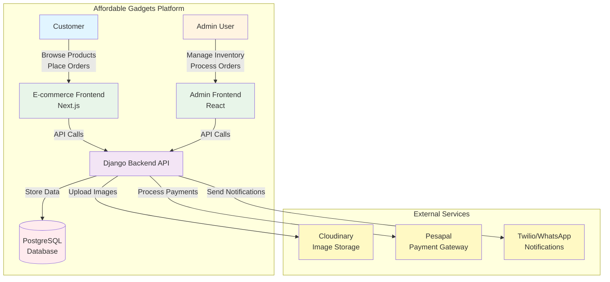

### Key Actors
- **Customer**: End users browsing and purchasing products
- **Admin User**: Staff managing inventory, orders, and content

### External Systems
- **Cloudinary**: Image and media storage/CDN
- **Pesapal**: Payment processing gateway
- **Twilio/WhatsApp**: SMS and WhatsApp notifications

---

## Level 2: Container Diagram

Shows the high-level technical building blocks and their responsibilities.

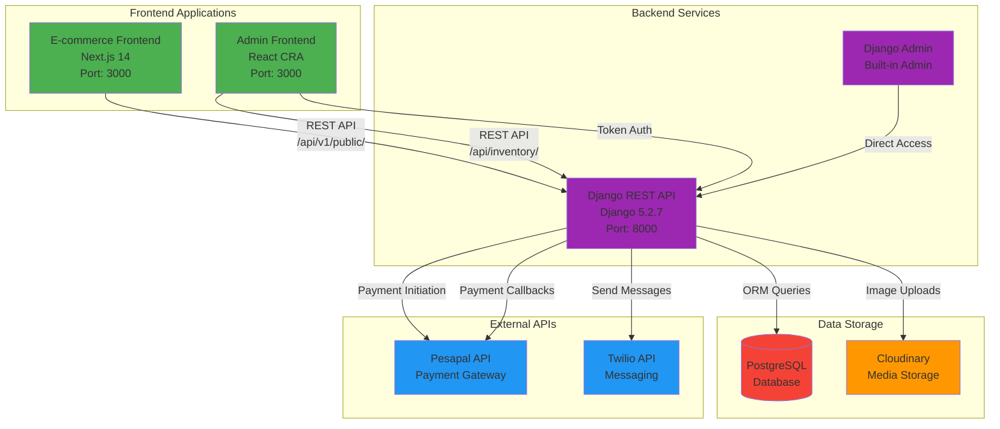

### Container Responsibilities

#### E-commerce Frontend (Next.js)
- **Technology**: Next.js 14, React, TypeScript, Tailwind CSS
- **Responsibilities**:
  - Product browsing and search
  - Shopping cart management
  - Checkout flow
  - Order tracking
  - Promotions display
  - SEO optimization

#### Admin Frontend (React)
- **Technology**: Create React App, React, TypeScript
- **Responsibilities**:
  - Inventory management
  - Order processing
  - Admin user management
  - Reports and analytics
  - Content management

#### Django REST API
- **Technology**: Django 5.2.7, Django REST Framework, drf-spectacular
- **Responsibilities**:
  - Business logic
  - Data validation
  - Authentication & authorization
  - API endpoints
  - Payment processing
  - Notification services

#### PostgreSQL Database
- **Responsibilities**:
  - Product catalog
  - Inventory units
  - Orders and transactions
  - User management
  - Reviews and promotions

---

## Level 3: Component Diagram - Backend

Detailed view of backend components and their interactions.

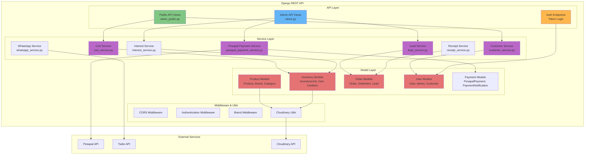

### Backend Components

#### API Layer
- **Public API Views** (`views_public.py`): Customer-facing endpoints
  - Products listing
  - Cart operations
  - Promotions
  - Budget search
  
- **Admin API Views** (`views.py`): Admin-only endpoints
  - Inventory management
  - Order processing
  - User management
  - Reports

#### Service Layer
- **Cart Service**: Shopping cart operations
- **Customer Service**: Customer management and recognition
- **Payment Service**: Pesapal payment integration
- **Lead Service**: Lead creation and management
- **Interest Service**: Product interest tracking
- **Receipt Service**: Order receipt generation
- **WhatsApp Service**: Notification delivery

---

## Level 4: Component Diagram - Frontend

Frontend application structure and components.

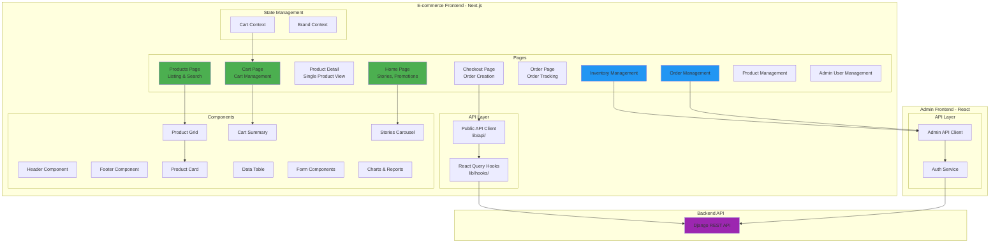

---

## Database Schema Diagram

High-level database relationships.

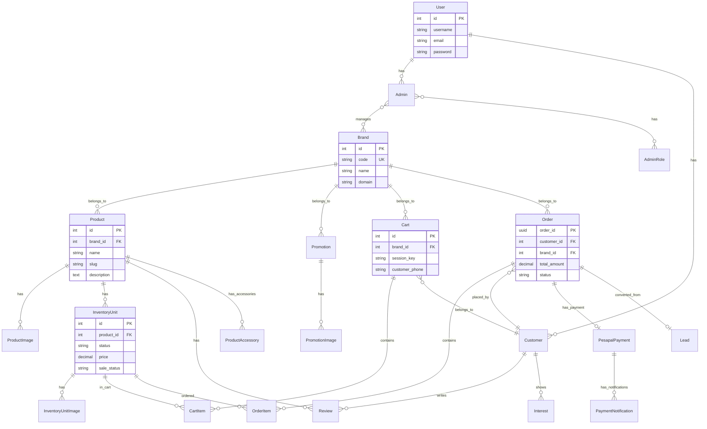

---

## Service Interaction Diagrams

### Cart Service Flow

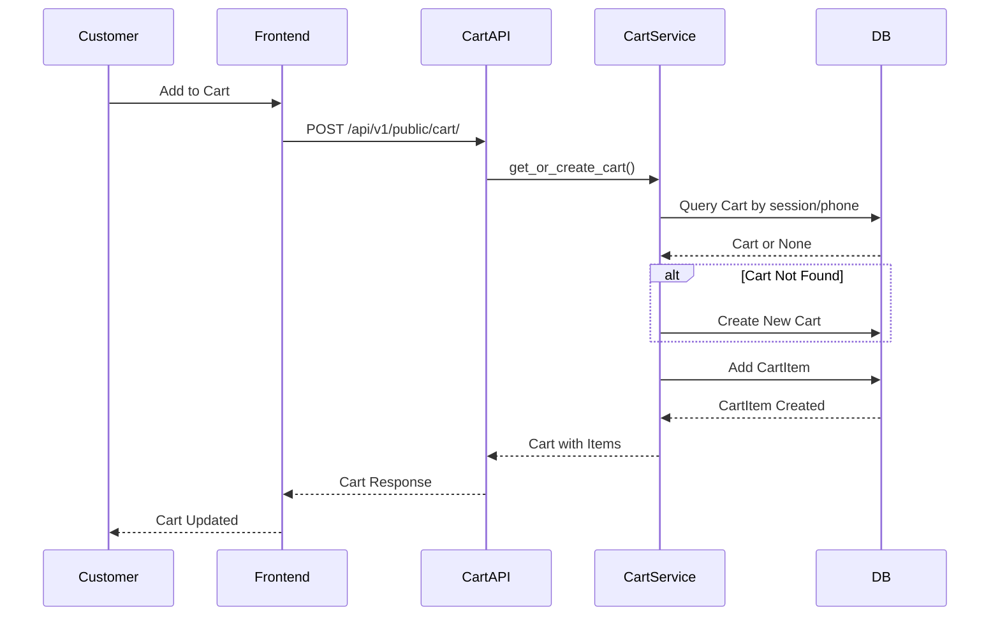

### Payment Flow

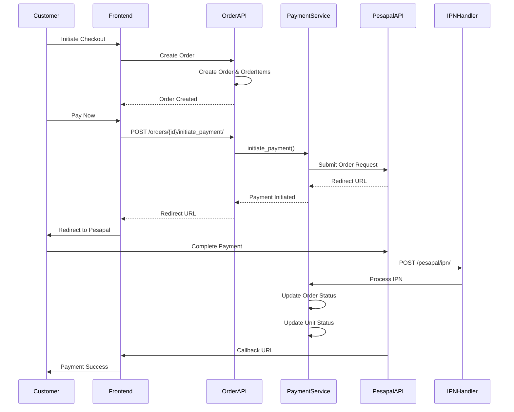

### Order Processing Flow

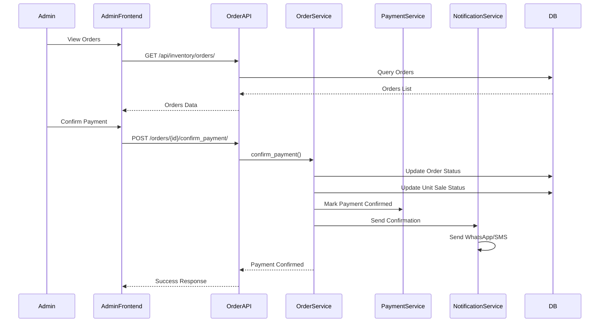

---

## API Flow Diagrams

### Public API Endpoints

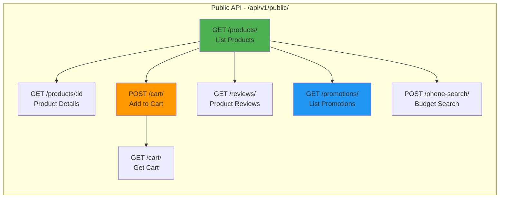

### Admin API Endpoints

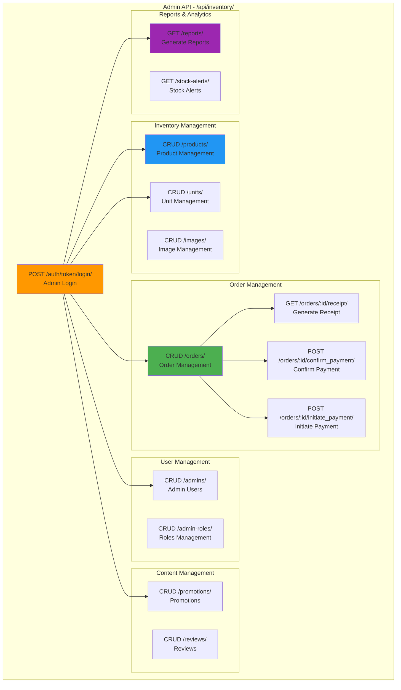

---

## Technology Stack Summary

### Backend
- **Framework**: Django 5.2.7
- **API**: Django REST Framework 3.16.1
- **Database**: PostgreSQL (via psycopg3)
- **Authentication**: Token Authentication
- **API Documentation**: drf-spectacular (OpenAPI 3.0)
- **Image Storage**: Cloudinary
- **Payment**: Pesapal API
- **Notifications**: Twilio

### Frontend - E-commerce
- **Framework**: Next.js 14
- **Language**: TypeScript
- **Styling**: Tailwind CSS
- **State Management**: React Query
- **API Client**: Generated from OpenAPI

### Frontend - Admin
- **Framework**: Create React App
- **Language**: TypeScript
- **State Management**: React Query
- **API Client**: Generated from OpenAPI

### Infrastructure
- **Backend Hosting**: Railway/Heroku
- **Frontend Hosting**: Vercel/Netlify
- **Database**: PostgreSQL (managed)
- **CDN**: Cloudinary

---

## Deployment Architecture

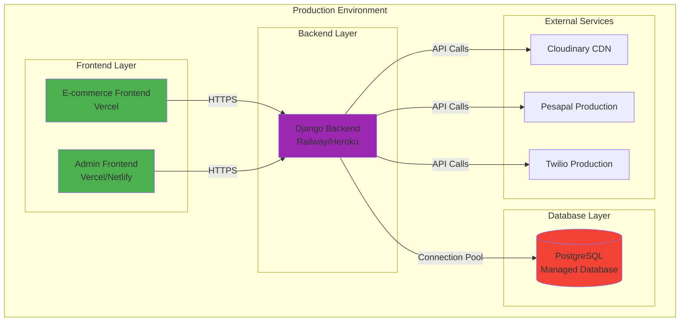

---

## How to View These Diagrams

### Option 1: Mermaid Live Editor
1. Copy any Mermaid diagram code
2. Go to https://mermaid.live
3. Paste the code
4. Export as PNG/SVG

### Option 2: VS Code Extension
1. Install "Markdown Preview Mermaid Support" extension
2. Open this file in VS Code
3. Use Markdown preview to see rendered diagrams

### Option 3: GitHub/GitLab
- These diagrams will render automatically in markdown files on GitHub/GitLab

### Option 4: Generate Static Images
```bash
# Install Mermaid CLI
npm install -g @mermaid-js/mermaid-cli

# Generate PNG from this file
mmdc -i ARCHITECTURE_DIAGRAMS.md -o architecture_diagrams.png
```

---

## Next Steps

1. **Generate Database ER Diagram**: Run `python manage.py graph_models` to create detailed database diagrams
2. **API Documentation**: View interactive API docs at `/api/schema/swagger-ui/`
3. **Sequence Diagrams**: Create detailed sequence diagrams for complex flows
4. **Deployment Diagrams**: Document specific deployment configurations

---

*Last Updated: $(date)*
*Generated for Affordable Gadgets Platform*
