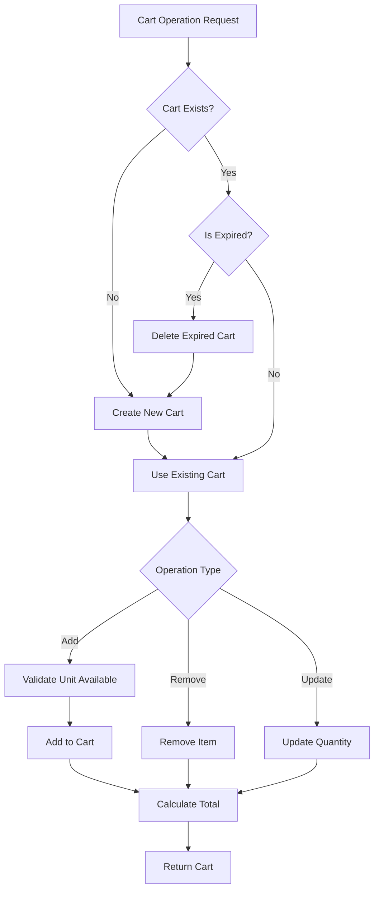
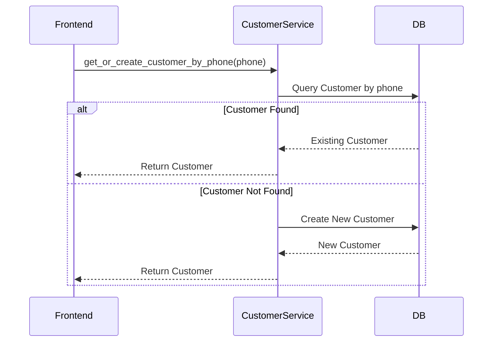
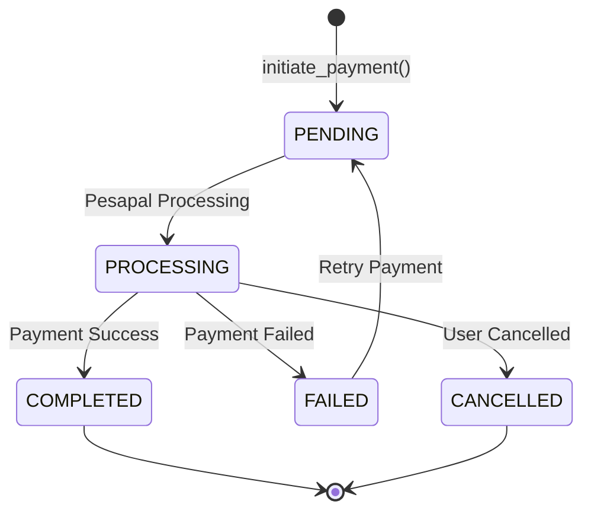
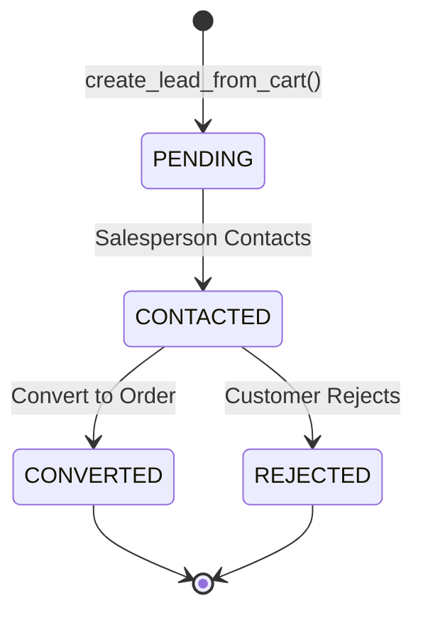
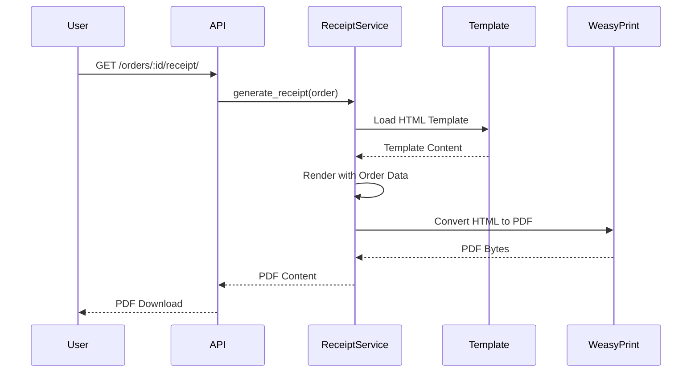
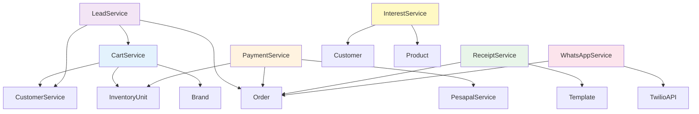

# Detailed Service Documentation

This document provides in-depth documentation of all backend services, their responsibilities, and interactions.

---

## Table of Contents

1. [Cart Service](#cart-service)
2. [Customer Service](#customer-service)
3. [Payment Service](#payment-service)
4. [Lead Service](#lead-service)
5. [Interest Service](#interest-service)
6. [Receipt Service](#receipt-service)
7. [WhatsApp Service](#whatsapp-service)
8. [Service Dependencies](#service-dependencies)

---

## Cart Service

**File**: `inventory/services/cart_service.py`

### Purpose
Manages shopping cart operations including creation, item management, and cart-to-order conversion.

### Key Methods

#### `get_or_create_cart(session_key, customer_phone, brand)`
- **Purpose**: Retrieve existing cart or create a new one
- **Logic**:
  1. First tries to find cart by customer phone
  2. Falls back to session key lookup
  3. Creates new cart if none found
  4. Cleans up expired carts automatically
- **Returns**: Cart instance

#### `add_item_to_cart(cart, unit, quantity)`
- **Purpose**: Add inventory unit to cart
- **Validations**:
  - Unit must be available (status: AVAILABLE)
  - Unit must belong to same brand as cart
  - Quantity must be positive
- **Returns**: CartItem instance

#### `remove_item_from_cart(cart, item_id)`
- **Purpose**: Remove item from cart
- **Returns**: Boolean success status

#### `update_cart_item_quantity(cart, item_id, quantity)`
- **Purpose**: Update quantity of cart item
- **Returns**: Updated CartItem instance

#### `get_cart_total(cart)`
- **Purpose**: Calculate total price of cart
- **Returns**: Decimal total amount

#### `clear_cart(cart)`
- **Purpose**: Remove all items from cart
- **Returns**: None

### Cart Expiration
- Carts expire after 7 days of inactivity
- Expired carts are automatically cleaned up

### Service Flow Diagram



---

## Customer Service

**File**: `inventory/services/customer_service.py`

### Purpose
Manages customer recognition, creation, and profile management. Uses phone number as primary identifier.

### Key Methods

#### `get_or_create_customer_by_phone(phone, name=None)`
- **Purpose**: Find customer by phone or create new one
- **Logic**:
  1. Searches for existing customer by phone
  2. Creates new customer if not found
  3. Updates name if provided and customer exists
- **Returns**: Customer instance

#### `recognize_customer(phone)`
- **Purpose**: Identify customer from phone number
- **Returns**: Customer instance or None

#### `update_customer_profile(customer, **kwargs)`
- **Purpose**: Update customer information
- **Fields**: name, email, delivery_address
- **Returns**: Updated Customer instance

### Customer Recognition Strategy
- **Primary Key**: Phone number (indexed for fast lookup)
- **No Password Required**: Phone-based recognition for guest checkout
- **Cross-Brand**: Customers are global, not brand-specific

### Service Flow Diagram



---

## Payment Service

**File**: `inventory/services/pesapal_payment_service.py`

### Purpose
Handles Pesapal payment gateway integration including payment initiation, IPN processing, and status tracking.

### Key Methods

#### `initiate_payment(order, callback_url, cancellation_url, customer, billing_address)`
- **Purpose**: Start Pesapal payment process
- **Process**:
  1. Validates order status and amount
  2. Creates PesapalPayment record
  3. Submits order to Pesapal API
  4. Stores tracking ID
  5. Returns redirect URL
- **Returns**: Dict with `redirect_url` and `order_tracking_id`

#### `get_payment_status(order)`
- **Purpose**: Check current payment status from Pesapal
- **Process**:
  1. Retrieves PesapalPayment record
  2. Queries Pesapal API for status
  3. Updates local payment record
  4. Returns status information
- **Returns**: Dict with payment status details

#### `process_ipn(ipn_data)`
- **Purpose**: Process Instant Payment Notification from Pesapal
- **Process**:
  1. Validates IPN signature
  2. Creates PaymentNotification record
  3. Updates order status based on payment status
  4. Updates inventory unit sale status
  5. Sends confirmation notifications
- **Returns**: Success status

### Payment Status Flow



### Payment Expiry
- Payments expire after 24 hours if not completed
- Expired payments can be re-initiated

### Service Dependencies
- `PesapalService`: Low-level Pesapal API client
- Order Model: Order status management
- InventoryUnit Model: Unit sale status updates

---

## Lead Service

**File**: `inventory/services/lead_service.py`

### Purpose
Manages lead creation and conversion. Leads are created during checkout and can be converted to orders by salespersons.

### Key Methods

#### `create_lead_from_cart(cart, customer_data)`
- **Purpose**: Create lead from shopping cart
- **Process**:
  1. Validates cart has items
  2. Creates Lead record
  3. Creates LeadItem for each cart item
  4. Clears cart
  5. Sends notification
- **Returns**: Lead instance

#### `convert_lead_to_order(lead, salesperson)`
- **Purpose**: Convert lead to confirmed order
- **Process**:
  1. Validates lead status
  2. Creates Order from lead
  3. Creates OrderItems from LeadItems
  4. Updates lead status to CONVERTED
  5. Reserves inventory units
- **Returns**: Order instance

### Lead Status Flow



### Lead Data Structure
- Customer information (phone, name, email)
- Cart items with quantities
- Total amount
- Brand association
- Timestamp and status

---

## Interest Service

**File**: `inventory/services/interest_service.py`

### Purpose
Tracks customer interest in products. Used for analytics and follow-up marketing.

### Key Methods

#### `record_interest(customer, product, unit=None)`
- **Purpose**: Record customer interest in product
- **Process**:
  1. Creates or updates Interest record
  2. Increments interest count
  3. Stores timestamp
- **Returns**: Interest instance

#### `get_customer_interests(customer)`
- **Purpose**: Get all products customer has shown interest in
- **Returns**: QuerySet of Interest records

#### `get_product_interest_count(product)`
- **Purpose**: Get total interest count for product
- **Returns**: Integer count

### Interest Tracking
- Tracks both product-level and unit-level interest
- Used for:
  - Product popularity metrics
  - Customer behavior analysis
  - Marketing campaigns

---

## Receipt Service

**File**: `inventory/services/receipt_service.py`

### Purpose
Generates order receipts as PDF documents using HTML templates.

### Key Methods

#### `generate_receipt(order)`
- **Purpose**: Generate PDF receipt for order
- **Process**:
  1. Loads HTML template
  2. Renders template with order data
  3. Converts HTML to PDF using WeasyPrint
  4. Returns PDF bytes
- **Returns**: BytesIO PDF content

#### `get_receipt_url(order)`
- **Purpose**: Get URL to download receipt
- **Returns**: URL string

### Receipt Template
- Located at: `templates/receipts/affordable_gadgets_receipt.html`
- Includes:
  - Order details
  - Customer information
  - Itemized list
  - Payment information
  - Branding

### Receipt Generation Flow



---

## WhatsApp Service

**File**: `inventory/services/whatsapp_service.py`

### Purpose
Sends WhatsApp notifications using Twilio API for order confirmations and updates.

### Key Methods

#### `send_order_confirmation(order)`
- **Purpose**: Send order confirmation message
- **Process**:
  1. Formats message with order details
  2. Sends via Twilio WhatsApp API
  3. Logs delivery status
- **Returns**: Message SID or None

#### `send_payment_confirmation(order)`
- **Purpose**: Send payment confirmation message
- **Returns**: Message SID or None

#### `send_notification(phone, message)`
- **Purpose**: Generic notification sender
- **Returns**: Message SID or None

### Notification Types
- Order confirmation
- Payment confirmation
- Order status updates
- Delivery notifications

### Service Configuration
- Uses Twilio WhatsApp Business API
- Requires Twilio credentials in environment
- Supports both WhatsApp and SMS fallback

---

## Service Dependencies

### Dependency Graph



### Service Interaction Patterns

#### Checkout Flow
```
CartService → LeadService → CustomerService → Order
```

#### Payment Flow
```
Order → PaymentService → PesapalService → PaymentService → Order
```

#### Order Confirmation Flow
```
Order → ReceiptService → PDF
Order → WhatsAppService → Notification
```

---

## Error Handling

All services implement consistent error handling:

1. **Validation Errors**: Return descriptive error messages
2. **External API Errors**: Log and return user-friendly messages
3. **Database Errors**: Use transactions for atomicity
4. **Timeout Handling**: Implement retry logic for external APIs

---

## Testing Services

### Unit Testing
Each service should have unit tests covering:
- Happy path scenarios
- Edge cases
- Error conditions
- Boundary conditions

### Integration Testing
Test service interactions:
- Cart → Lead conversion
- Payment → Order updates
- Notification delivery

---

*Last Updated: $(date)*
